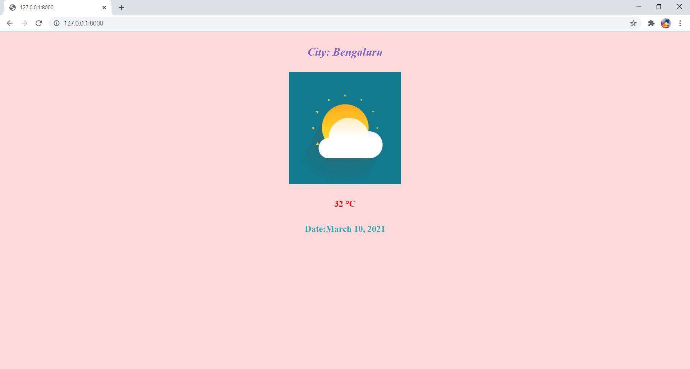

# Weather_App
A Web Application created using Django Framework for displaying the current weather of any city in the entire world.

For Backend using Django Framework and Front End using Bootstrap

To build this Django project we must do 2 steps. They are.

1) Scrap the data from a website using python
2) Build a Django project using weather data

OUTPUT:
--------

STEPS TO RUN THIS PROJECT

Step - 1: Download the code from above

Step - 2: create a virtual environment

    python -m virtualenv dj
  
Step - 3: Installing Django Python
  
  Now install Django in our virtual environment by the following command.
    
    python -m pip install django
    
Step - 4: Create a Django project

  Now create a Django project with the below command. Here “weatherApplication” is the project name
  
    django-admin startproject weatherApplication
    
Step - 5: Create a Django app

  To create a Django app in the Django project we need to execute the below command. Here WeatherApp is an app name(After this, include all code downloaded from above )
  
    python manage.py startapp WeatherApp
    
Step - 6: Run your project

  Now change your directory to project folder like “cd <projectfolder>” in windows. Now run on command prompt like below.
  
    python manage.py runserver

---------------------------------------------------------------------------------------------------------------------------------------------------------------------------------

STEPS TO IMPLEMENT A PROJECT

Step - 1: create a virtual environment

    python -m virtualenv dj
  
Step - 2: Installing Django Python
  
  Now install Django in our virtual environment by the following command.
    
    python -m pip install django
    
Step - 3: Create a Django project

  Now create a Django project with the below command. here “devpyjp” is the project name
  
    django-admin startproject weatherApplication
    
Step - 4: Create a Django app

  To create a Django app in the Django project we need to execute the below command. Here WeatherApp is an app name
  
    python manage.py startapp WaetherApp
    
    
  There are four important files in every python Django project. they are

  models.py
  views.py
  urls.py
  and templates.
  
Step - 5: change Django settings file

    a) APP installations
    
      when we create a new app, we must install our app in settings.py file. let’s do that configure also.
      
      INSTALLED_APPS = [

                 'WeatherApp',

]
  
    b) Let’s open your settings.py in your Django project folder and open settings.py. Go to the Templates attribute and change the path like below. Make sure you must create a folder name called templates outside of the project folder.
    
    TEMPLATES = [
    {
        
        'DIRS': [os.path.join(BASE_DIR,'templates')], # this is your template folder path.
        
    },
]

  c) Setup your Time zone
  
      TIME_ZONE =  'Asia/Kolkata'
      
  d) STATIC_URL = '/static/'

      STATICFILES_DIRS = [
          os.path.join(BASE_DIR, "static") # this is your static folder
      ]

      STATIC_ROOT = os.path.join(BASE_DIR,'assets') #this is you assets folder.
 
Step - 6: scrap the data using python
  Before you start, you must have requests and Beautifulsoup packages in your system. 
  If you don’t have then use these commands on your prompt.

    pip install requests

    pip install bs4

To grab the weather data I used here a website called www.timeanddate.com.
